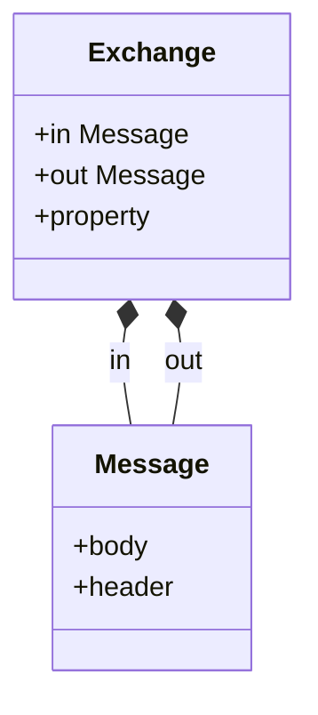

# はじめに
JavaのEIP（エンタープライズインテグレーションパターン)を手軽に実装できるフレームワーク。日本語で分かりやすい入門記事がなかったので記載。競合フレームワークとしてはSpring Integrationがあるが、Spring Integrationより遥かに使いやすい。RedHatが自社サービスに取り込んでいるため、QuarkusなどのIBM/RedHat製品群と相性いいが、Spring サポートも昔から充実しているため、Spring使っているところでもお勧め

## 他参考記事
- [実践EIP](https://docs.google.com/presentation/d/e/2PACX-1vTTmM5Ljx54uwTsywyV0yFJ_ee5ZjsDgFlbZfnqaTN2xcx6ejrjdW9OttmxagLx-GeVQLIIeGMBweKr/pub?slide=id.p)
- [RedHatの記事](https://rheb.hatenablog.com/entry/2022/05/27/191550)
- [公式サイト](https://camel.apache.org/)

## 基本概念

### Camel Component
- ファイル連携やメッセージングシステムなどの処理を行うクラス群
  - ファイル連携を行うFileコンポーネントやJMSメッセージを行うJMSコンポーネント、AWS連携コンポーネントや独自定義のjavaクラスのメソッドを呼ぶコンポーネントなど連携処理毎に用意されている。
  - コンポーネントにはEndpointが存在し、エンドポイントに対してメッセージを送受信することでCamelComponentが処理を実行する
    - 処理を実行するのは、コンポーネント/エンドポイントから生成されたProducer(メッセージ送信)とComsumer(メッセージ受信)である。
  - エンドポイントにはURIが定義されている。後述のルート定義ではURIを利用してコンポーネントを利用する。
  - [コンポーネントドキュメント](https://camel.apache.org/components/3.20.x/index.html)
:::message
実装上は厳密には、ComponentがEndpointを生成し、EndpointがProducerとComsumerを生成するって関係。
:::

### ルート
- コンポーネント間のメッセージ連携を定義するルート。
- 下記のようにRoutBuilderを継承して定義する。
```java
public class SampleRoute extends RouteBuilder {
    @Override
    public void configure() throws Exception {
        //directコンポーネントが受信したメッセージをFileコンポーネントに渡すルートの定義
        from("direct:xxx")
                .to("file:dirName?fileName=xyz");
    }
}
```

- 上記のルートに対しては、下記のようにProducerTemplateを使ってメッセージを送信できる。
```java
class ProducerSample {
    ProducerTemplate producerTemplate;
    void sample() throws InterruptedException {
        producerTemplate.requestBody("direct:xxx","Hello");
    }
}

```
####  ルートの起動
- アプリケーション起動時にルートも起動され、メッセージの待ち受けが開始される。

### 中間ノードとプロセス
- ルートには、条件分岐や編集処理など様々な処理を挟むことができる。EIPパターンは網羅しているとのこと。
```java
。その値をheaderに設定。
from("direct:xxx")
//ボディ部の文字列をjsonとしてパースし、JavaBeanにマッピング
                .unmarshal().json(JsonLibrary.Jackson, ConvertRouteInput.class)
		//メッセージヘッダーに値を設定
                .setHeader("inputDirPath", simple(inputDirPath))
                .to("file:xyz");
```
- 中間ノードの実態として動作するのはProcessインタフェースを実装したクラス。Processインタフェースは関数型インタフェースでもあるので、後述したExchangeクラスのインスタンスを受け取る関数でも良い。
```java
        from("direct:xxx")
                .unmarshal().json(JsonLibrary.Jackson, ConvertRouteInput.class)
                .setHeader("inputDirPath", simple(inputDirPath))
                .process(exchange -> exchange.getMessage().setHeader("abc","aaa"))
                .to("file:xyz");
```


### メッセージ/メッセージボディ/Exchange
- コンポーネントやプロセスが送信したり、受信したりするメッセージは下記のようなExchangeオブジェクトにカプセル化されている。コンポーネントやプロセスはExchangeオブジェクトを生成/編集する
	- メッセージにはボディ部（Object型）とマップ形式のHeaderがある。
	- Exchangeにもマップ形式のPropertyがある


- コンポーネントやプロセスがinメッセージを受け取り、exchangeに対してoutメッセージをセットする。
	- デフォルトでは、inメッセージのヘッダーはoutに引き継がれる。body部も編集しなければ引き継がれる。
	- Processを独自実装する場合も、原則としてinMessageを編集するのが推奨。明示的にoutを扱わなくても自動的にoutに引き継がれる。Exchange#getMessageメソッドはinメッセージを取得する。
- Exchangeプロパティはルート実行中共有されるが、メッセージはコンポーネントやプロセスによっては全く異なるものに設定可能だったり、別のルート定義に遷移した場合などは消える。ルート全体で共有したい情報はExchangeプロパティに設定する。スコープの短いものはメッセージヘッダーで良い。

#### Beanコンポーネント
- 独自実装のJavaメソッドを呼び出すコンポーネント
- 引数としてはExchange/Message/任意のクラスを取れる
	- expression言語を使えば複数の引数を取ることも可能
	- 任意のクラスの場合はメッセージボディ部がキャストされる。
- 戻り値を返すとoutメッセージに設定される。Message型ならそのまま、Message型でないならMessageのbody部に設定される。

```java
public class SampleService {

    public String hello(String input){
        return "Hello";
    }

    public String hello2(String input,String input2){
        return "Hello";
    }
}
```

```java
    @Override
    public void configure() throws Exception {
        from("direct:xxx")
                .unmarshal().json(JsonLibrary.Jackson, ConvertRouteInput.class)
                .setHeader("inputDirPath", simple(inputDirPath))
                .process(exchange -> exchange.getMessage().setHeader("abc","aaa"))
                .bean(new SampleService(),"hello")
		//第一引数にはbodyを第二引数にはheaderのxyzを渡す
		.bean(new SampleService(),"hello2(${body},${header.xyz})")
                .to("file:xyz");
    }
```

- Spring連携を行なっている場合や後述するregistoryにBeanを登録している場合、インスタンスの代わりにクラス指定やbean名指定でも可能
```java
        from("direct:xxx")
                .unmarshal().json(JsonLibrary.Jackson, ConvertRouteInput.class)
                .setHeader("inputDirPath", simple(inputDirPath))
                .process(exchange -> exchange.getMessage().setHeader("abc","aaa"))
                .bean(SampleService.class,"hello")
                .to("file:xyz");
```
:::message
メソッド名は@Handlerアノテーションを付与しておくと省略できる。
:::

### Camelコンテキスト
- ルートやコンポーネントの登録、起動停止やBeanなどCamel全体の管理を行うオブジェクト
- SpringやQuarkusでは自動で作成される。設定などをカスタマイズする場合はDIコンテナから取得して利用する

